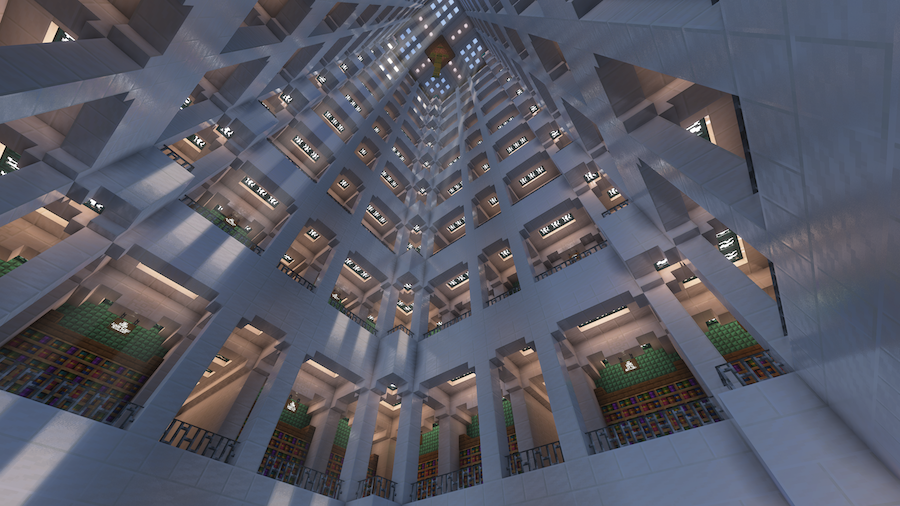
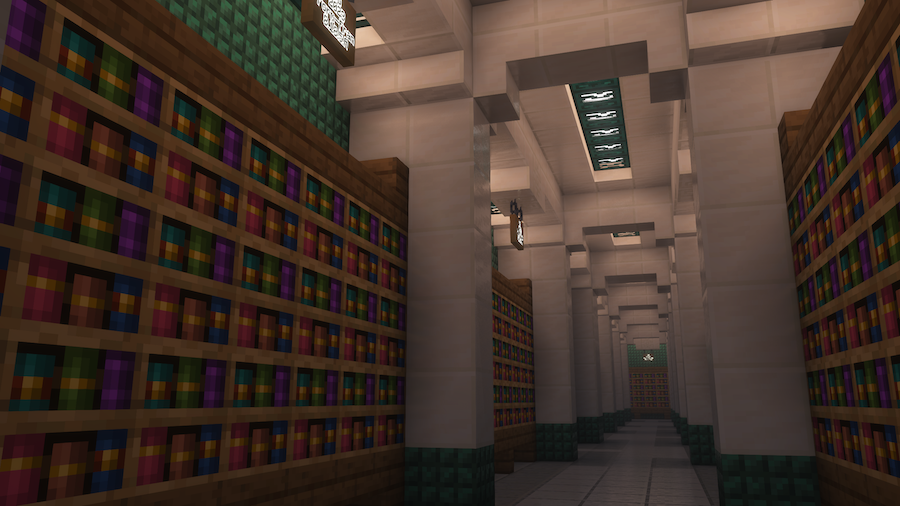
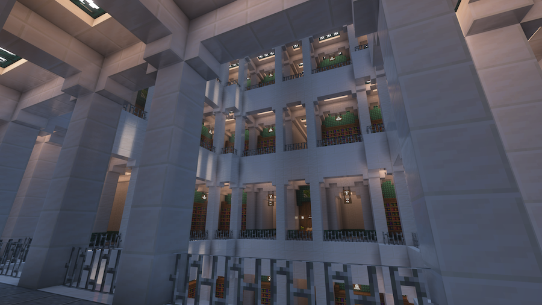
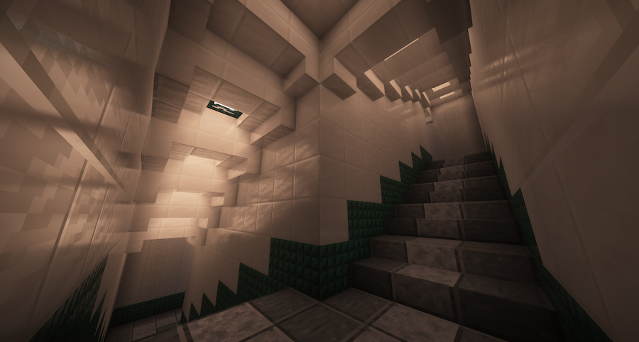
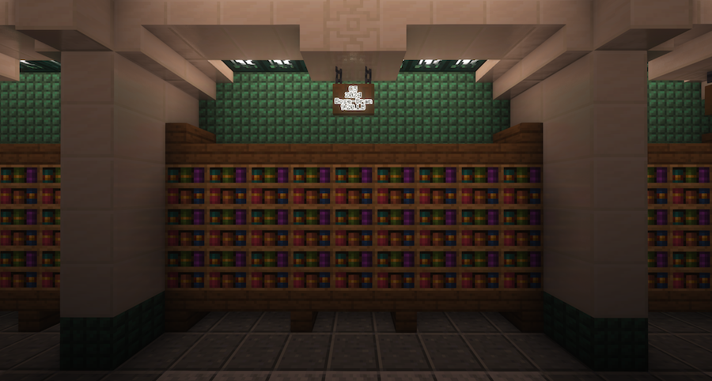
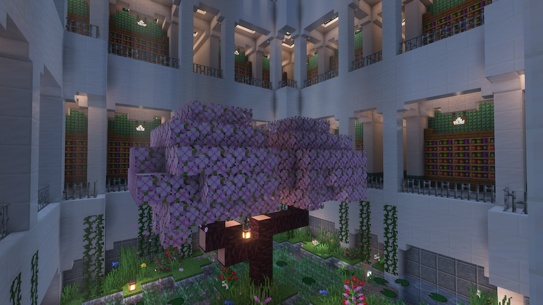
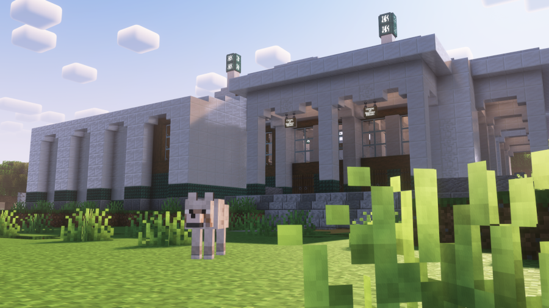
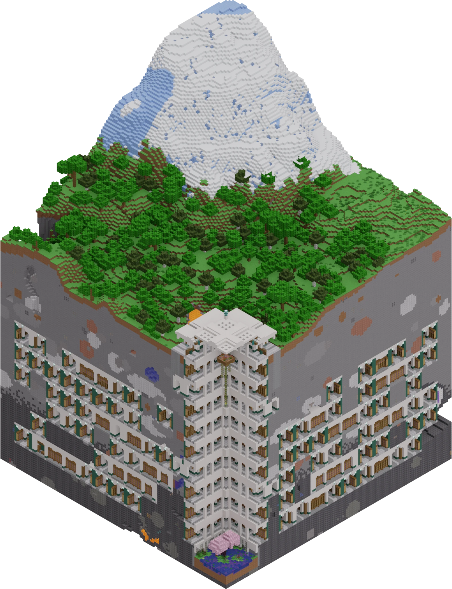
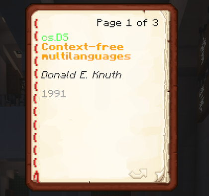
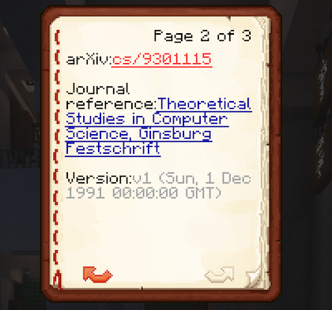

# GDMC 2024
Submission by Niels-NTG for the [2024 Generative Design in Minecraft AI Settlement Generation Challenge](https://gendesignmc.wikidot.com/wiki:2024-settlement-generation-competition).

In this competition participants design and implement an algorithm that constructs a settlement in Minecraft. Submissions are judged on the aesthetics and narrative qualities of the output, on how functional the structure is from a gameplay perspective, and how well it adapts to any arbitrary Minecraft landscape.

## Vault of Immeasurable Knowledge
The Vault of Immeasurable Knowledge is a massive underground library that contains every computer science paper ever published on [ArXiv](https://arxiv.org), the free and open science repository by Cornell University.

After entering the surface access building you are greeted by an atrium that spans the entire depth of the library, The contents of the library are grouped by publication year ranging from 1990 till now. Each year is sorted alphabetically by primary author of the work. Each landing has way finding indicating the range of works on this floor, as well as an index listing the range of works for each cabinet on that floor.

*View up of the central atrium.*

*One of many labyrinthine hallways filled with books containing abstracts of real-life scientific papers.*

*Staircase that winds around the central atrium connecting all floors.*

*Small garden located at the bottom of the atrium.*

*Exterior view of the surface entrance.*

*Isometric rendering of the whole structure. Image credit goes to [Arhur van der Staaij](https://github.com/avdstaaij), who created this using his [mcrender](https://github.com/avdstaaij/mcrender) tool.*

*Book generated based on the metadata of [Context-free multilanguages (1991) by Donald E. Knuth](https://arxiv.org/abs/cs/9301115).*

### Setup

This program is designed to work with Minecraft 1.20.2 combined with the [HTTP Interface Forge mod](https://github.com/Niels-NTG/gdmc_http_interface/). The program itself is written for Python 3.11 and requires the packages listed `requirements.txt` (with the exception of `kaggle`, which is only needed to update the dataset). Also don't forget to run `git submodule update --init` in install the custom fork of the `gdpc` package. To start the generator, open a world in Minecraft, run the in-game `/setbuiltarea fromX fromY fromZ toX toY toZ` command and run `main.py`, no CLI arguments required.

### Method

#### Pre-built structures
The generator is primarily designed around placing discrete pre-build structures into the world. Each structure is designed by hand and are defined as folders containing an [NBT](https://minecraft.wiki/w/NBT_format) file and a Python file with the same name of a class inheriting from ` StructureBase.py` that defines custom behaviour and properties of that structure.

#### Wave Function Collapse (WFC)
The layout of each floor is constructed using the [Wave Function Collapse (WFC) algorithm](https://www.boristhebrave.com/2020/04/13/wave-function-collapse-explained/). Each structure has constraints defining which structures can be adjacent to other structures, which includes relative position (front, back, left, right, up and down) and rotation. When initialising, the system creates a volume grid where each cell contains all possible states (all structures with all possible rotations). Then the system propagates through all cells trying to reduce the entropy of the volume either until all cells are fully collapsed to a single state. Depending on the size of the volume and the complexity of the constraints this may require more than one attempt. For this reason the generator spawns parallel processes to find a valid solution quicker.

#### Written books
Since Minecraft 1.20 it's possible to construct book shelves with actual written books inside of them.

The books in this generator are created from the [Kaggle dataset](https://www.kaggle.com/datasets/Cornell-University/arxiv) that contains metadata of all works on ArXiv. This metadata includes the title, authors, publication dates, version history, abstract and additional notes, amongst other things, but not the content of the papers itself. Kaggle provides this data as one massive text tile where each entry is represented by a JSON object and a line break. To parse this into a format Minecraft can understand we first split the entries per its primary category (eg. `cs.AI`, `math.CT`, `physics.atom-ph`, etc.) and publication year. It writes a file for each category-year combination, with each entry converted into an [SNBT format](https://minecraft.wiki/w/NBT_format#SNBT_format) for Minecraft's [written books](https://minecraft.wiki/w/Written_Book#Item_data). This includes the title, authors, DOI, ArXiv ID, topics, publication year and additional notes. Sadly due to limitations on memory/storage size of chunks in Minecraft it isn't possible to include the abstracts for very categories such as computer science or mathematics without the game becoming unresponsive or crashing.
